# Sistema POS (Punto de Venta)

Sistema completo de punto de venta para gestión de múltiples sucursales con control de inventarios, ventas, facturación y cajas registradoras.

## Características Principales

### Gestión de Sucursales
- **Múltiples sucursales**: Administración centralizada de todas las sucursales
- **Inventario por sucursal**: Control de stock independiente para cada ubicación
- **Usuarios por rol**: Sistema de usuarios con roles y permisos específicos
- **Asignación por sucursal**: Usuarios asignados a sucursales específicas para control de acceso

### Gestión de Inventario
- **Productos por departamento**: Organización de productos en departamentos
- **Códigos de barras**: Soporte para lectura de códigos de barras
- **Múltiples precios**: Precio al menudeo, mayoreo y súper mayoreo
- **Control de stock**: Inventario por sucursal en tiempo real
- **Movimientos de inventario**: Registro detallado de entradas/salidas con razones

### Punto de Venta
- **Cajas registradoras**: Control de apertura y cierre de caja
- **Múltiples métodos de pago**: Efectivo, tarjeta, transferencia, etc.
- **Cálculo de utilidad**: Seguimiento de ganancias por venta
- **Ventas por cliente**: Asociación de ventas con clientes

### Facturación Electrónica
- **Generación de facturas**: Sistema de facturación con UUID
- **Vinculación con ventas**: Facturación de ventas realizadas
- **Control de estatus**: Seguimiento de facturas emitidas

## Tecnologías

- **Backend**: Laravel 12 (PHP 8.4)
- **Base de datos**: MySQL 8.0
- **Contenedores**: Docker + Docker Compose
- **Servidor web**: Nginx
- **Gestor de procesos**: Supervisor

## Requisitos

- Docker Desktop
- Docker Compose
- WSL 2 (para Windows)
- 4GB RAM mínimo
- 10GB espacio en disco

## Instalación

### 1. Clonar el repositorio

```bash
git clone <repository-url>
cd pos
```

### 2. Configurar variables de entorno

El archivo `.env` ya está configurado con los siguientes valores:

```env
DB_CONNECTION=mysql
DB_HOST=mysql
DB_PORT=3306
DB_DATABASE=pos_db
DB_USERNAME=pos_user
DB_PASSWORD=pos_password
```

### 3. Levantar los servicios con Docker

```bash
docker compose up -d
```

### 4. Instalar dependencias (si es necesario)

```bash
docker compose exec pos-app composer install
```

### 5. Generar clave de aplicación (si es necesario)

```bash
docker compose exec pos-app php artisan key:generate
```

### 6. Ejecutar migraciones

```bash
docker compose exec pos-app php artisan migrate
```

### 7. Poblar base de datos (opcional)

```bash
docker compose exec pos-app php artisan db:seed
```

## Acceso a los Servicios

- **Aplicación Laravel**: http://localhost:8080
- **phpMyAdmin**: http://localhost:8082
- **MySQL**: localhost:3307

### Credenciales de MySQL

- **Usuario**: pos_user
- **Contraseña**: pos_password
- **Base de datos**: pos_db

## Diagrama de Base de Datos

```mermaid
erDiagram

    SETTINGS {
        bigint id PK
        string key UK
        text value
        string type
        datetime created_at
        datetime updated_at
    }

    BRANCHES {
        bigint id PK
        string name
        string address
        boolean is_active
        datetime created_at
        datetime updated_at
    }

    USERS {
        bigint id PK
        bigint branch_id FK
        string name
        string email
        string password
        string role
        boolean is_active
        datetime created_at
        datetime updated_at
    }

    DEPARTMENTS {
        bigint id PK
        string name
        datetime created_at
        datetime updated_at
    }

    PRODUCTS {
        bigint id PK
        bigint department_id FK
        string barcode
        string name
        string sale_type
        string unit_base
        decimal price_retail
        decimal price_wholesale
        decimal price_super_wholesale
        decimal cost
        boolean is_active
        datetime created_at
        datetime updated_at
    }

    INVENTORIES {
        bigint id PK
        bigint product_id FK
        bigint branch_id FK
        decimal stock_quantity
        datetime created_at
        datetime updated_at
    }

    INVENTORY_MOVEMENTS {
        bigint id PK
        bigint product_id FK
        bigint branch_id FK
        bigint user_id FK
        string type
        decimal quantity
        string reason
        datetime created_at
    }

    CASH_REGISTERS {
        bigint id PK
        bigint branch_id FK
        bigint user_id FK
        datetime opened_at
        datetime closed_at
        decimal opening_amount
        decimal closing_amount
        decimal total_sales
        decimal total_profit
        string status
    }

    SALES {
        bigint id PK
        bigint branch_id FK
        bigint cash_register_id FK
        bigint user_id FK
        bigint client_id FK
        decimal subtotal
        decimal total
        decimal profit
        string payment_method
        datetime created_at
    }

    SALE_ITEMS {
        bigint id PK
        bigint sale_id FK
        bigint product_id FK
        decimal quantity
        decimal unit_price
        decimal cost
        decimal total
    }

    CLIENTS {
        bigint id PK
        string name
        string phone
        string rfc
        datetime created_at
        datetime updated_at
    }

    INVOICES {
        bigint id PK
        bigint sale_id FK
        bigint client_id FK
        string uuid
        string status
        decimal total
        datetime created_at
    }

    %% RELATIONSHIPS

    BRANCHES ||--o{ USERS : assigns
    BRANCHES ||--o{ INVENTORIES : holds
    BRANCHES ||--o{ CASH_REGISTERS : operates
    BRANCHES ||--o{ SALES : generates

    DEPARTMENTS ||--o{ PRODUCTS : groups

    PRODUCTS ||--o{ INVENTORIES : stocked_in
    PRODUCTS ||--o{ INVENTORY_MOVEMENTS : tracked_by
    PRODUCTS ||--o{ SALE_ITEMS : sold_as

    INVENTORIES }o--|| BRANCHES : belongs_to

    USERS ||--o{ INVENTORY_MOVEMENTS : performs
    USERS ||--o{ CASH_REGISTERS : opens
    USERS ||--o{ SALES : sells

    CASH_REGISTERS ||--o{ SALES : records

    SALES ||--o{ SALE_ITEMS : contains
    SALES ||--o| INVOICES : generates

    CLIENTS ||--o{ SALES : purchases
    CLIENTS ||--o{ INVOICES : billed_for
```



## Estructura de Tablas

### Módulo de Configuración

#### `settings`
Configuración global del sistema y datos del negocio (clave-valor).

| Campo | Tipo | Descripción |
|-------|------|-------------|
| id | bigint | Identificador único |
| key | string | Clave única (ej: "business_name", "business_rfc", "logo_url") |
| value | text | Valor de la configuración (puede ser JSON para datos complejos) |
| type | string | Tipo de dato (string, json, boolean, number, etc.) |
| created_at | datetime | Fecha de creación |
| updated_at | datetime | Fecha de actualización |

**Configuraciones sugeridas:**
- `business_name`: Razón social del negocio
- `business_rfc`: RFC para facturación
- `fiscal_address`: Domicilio fiscal
- `logo_url`: URL del logotipo
- `invoice_series`: Serie de facturas
- `default_tax_rate`: Tasa de IVA por defecto
- `currency`: Moneda (MXN)

### Módulo de Sucursales

#### `branches`
Sucursales del negocio.

| Campo | Tipo | Descripción |
|-------|------|-------------|
| id | bigint | Identificador único |
| name | string | Nombre de la sucursal (ej: "Sucursal Centro", "Sucursal Norte") |
| address | string | Dirección física completa |
| is_active | boolean | Estado activo/inactivo (para habilitar/deshabilitar sucursales) |
| created_at | datetime | Fecha de creación |
| updated_at | datetime | Fecha de actualización |

#### `users`
Usuarios del sistema con roles y asignación a sucursales.

| Campo | Tipo | Descripción |
|-------|------|-------------|
| id | bigint | Identificador único |
| branch_id | bigint | ID de la sucursal asignada (puede ser null para administradores) |
| name | string | Nombre completo del usuario |
| email | string | Correo electrónico (usado para login) |
| password | string | Contraseña encriptada con bcrypt |
| role | string | Rol del usuario (admin, gerente, cajero, almacenista, etc.) |
| is_active | boolean | Estado activo/inactivo |
| created_at | datetime | Fecha de creación |
| updated_at | datetime | Fecha de actualización |

### Módulo de Productos

#### `departments`
Departamentos para categorizar productos (ej: Abarrotes, Lácteos, Bebidas, etc.).

| Campo | Tipo | Descripción |
|-------|------|-------------|
| id | bigint | Identificador único |
| name | string | Nombre del departamento |
| created_at | datetime | Fecha de creación |
| updated_at | datetime | Fecha de actualización |

#### `products`
Catálogo global de productos con precios diferenciados.

| Campo | Tipo | Descripción |
|-------|------|-------------|
| id | bigint | Identificador único |
| department_id | bigint | ID del departamento |
| barcode | string | Código de barras (único) |
| name | string | Nombre del producto |
| sale_type | string | Tipo de venta (pieza, granel, peso, etc.) |
| unit_base | string | Unidad base de medida (kg, lt, pza, etc.) |
| price_retail | decimal | Precio al menudeo |
| price_wholesale | decimal | Precio al mayoreo |
| price_super_wholesale | decimal | Precio al súper mayoreo |
| cost | decimal | Costo del producto |
| is_active | boolean | Estado activo/inactivo |
| created_at | datetime | Fecha de creación |
| updated_at | datetime | Fecha de actualización |

### Módulo de Inventario

#### `inventories`
Stock de productos por sucursal.

| Campo | Tipo | Descripción |
|-------|------|-------------|
| id | bigint | Identificador único |
| product_id | bigint | ID del producto |
| branch_id | bigint | ID de la sucursal |
| stock_quantity | decimal | Cantidad en stock |
| created_at | datetime | Fecha de creación |
| updated_at | datetime | Fecha de actualización |

#### `inventory_movements`
Registro de todos los movimientos de inventario.

| Campo | Tipo | Descripción |
|-------|------|-------------|
| id | bigint | Identificador único |
| product_id | bigint | ID del producto |
| branch_id | bigint | ID de la sucursal |
| user_id | bigint | ID del usuario que realiza el movimiento |
| type | string | Tipo: entrada/salida |
| quantity | decimal | Cantidad del movimiento |
| reason | string | Razón del movimiento |
| created_at | datetime | Fecha del movimiento |

### Módulo de Ventas

#### `cash_registers`
Control de cajas registradoras.

| Campo | Tipo | Descripción |
|-------|------|-------------|
| id | bigint | Identificador único |
| branch_id | bigint | ID de la sucursal |
| user_id | bigint | ID del cajero |
| opened_at | datetime | Fecha/hora de apertura |
| closed_at | datetime | Fecha/hora de cierre |
| opening_amount | decimal | Monto inicial |
| closing_amount | decimal | Monto final |
| total_sales | decimal | Total de ventas |
| total_profit | decimal | Utilidad total |
| status | string | Estado: abierta/cerrada |

#### `sales`
Registro de ventas realizadas.

| Campo | Tipo | Descripción |
|-------|------|-------------|
| id | bigint | Identificador único |
| branch_id | bigint | ID de la sucursal |
| cash_register_id | bigint | ID de la caja |
| user_id | bigint | ID del vendedor |
| client_id | bigint | ID del cliente (opcional) |
| subtotal | decimal | Subtotal de la venta |
| total | decimal | Total de la venta |
| profit | decimal | Utilidad de la venta |
| payment_method | string | Método de pago |
| created_at | datetime | Fecha de la venta |

#### `sale_items`
Detalle de productos vendidos.

| Campo | Tipo | Descripción |
|-------|------|-------------|
| id | bigint | Identificador único |
| sale_id | bigint | ID de la venta |
| product_id | bigint | ID del producto |
| quantity | decimal | Cantidad vendida |
| unit_price | decimal | Precio unitario |
| cost | decimal | Costo unitario |
| total | decimal | Total del item |

### Módulo de Clientes y Facturación

#### `clients`
Catálogo global de clientes (compartido entre todas las sucursales).

| Campo | Tipo | Descripción |
|-------|------|-------------|
| id | bigint | Identificador único |
| name | string | Nombre completo o razón social del cliente |
| phone | string | Teléfono de contacto |
| rfc | string | RFC del cliente (requerido para facturación) |
| created_at | datetime | Fecha de creación |
| updated_at | datetime | Fecha de actualización |

#### `invoices`
Facturas electrónicas generadas.

| Campo | Tipo | Descripción |
|-------|------|-------------|
| id | bigint | Identificador único |
| sale_id | bigint | ID de la venta |
| client_id | bigint | ID del cliente |
| uuid | string | UUID de la factura (SAT) |
| status | string | Estado de la factura |
| total | decimal | Total facturado |
| created_at | datetime | Fecha de emisión |

## Comandos Útiles

### Docker

```bash
# Levantar servicios
docker compose up -d

# Detener servicios
docker compose down

# Ver logs
docker compose logs -f

# Ver logs de un servicio específico
docker compose logs -f pos-app

# Reiniciar servicios
docker compose restart

# Reconstruir imágenes
docker compose build

# Ver estado de contenedores
docker compose ps
```

### Laravel/Artisan

```bash
# Acceder al contenedor
docker compose exec pos-app bash

# Ejecutar migraciones
docker compose exec pos-app php artisan migrate

# Rollback de migraciones
docker compose exec pos-app php artisan migrate:rollback

# Crear nueva migración
docker compose exec pos-app php artisan make:migration create_table_name

# Crear modelo
docker compose exec pos-app php artisan make:model ModelName

# Crear controlador
docker compose exec pos-app php artisan make:controller ControllerName

# Limpiar caché
docker compose exec pos-app php artisan cache:clear
docker compose exec pos-app php artisan config:clear
docker compose exec pos-app php artisan route:clear
docker compose exec pos-app php artisan view:clear

# Crear seeder
docker compose exec pos-app php artisan make:seeder SeederName

# Ejecutar seeders
docker compose exec pos-app php artisan db:seed

# Crear factory
docker compose exec pos-app php artisan make:factory FactoryName
```

### Base de Datos

```bash
# Acceder a MySQL desde el contenedor
docker compose exec mysql mysql -u pos_user -p pos_db

# Backup de base de datos
docker compose exec mysql mysqldump -u pos_user -p pos_db > backup.sql

# Restaurar base de datos
docker compose exec -T mysql mysql -u pos_user -p pos_db < backup.sql
```

## Flujo de Trabajo

### 1. Configuración Inicial
1. Configurar datos del negocio en `settings` (nombre, RFC, dirección fiscal, logo)
2. Crear sucursales
3. Crear departamentos para organizar productos
4. Crear usuarios y asignar roles y sucursales

### 2. Gestión de Productos
1. Registrar productos con sus precios
2. Asignar departamento
3. Configurar inventario inicial por sucursal

### 3. Operación Diaria
1. Apertura de caja (cash_register)
2. Registro de ventas (sales)
3. Actualización automática de inventario
4. Cierre de caja

### 4. Facturación
1. Seleccionar venta a facturar
2. Asignar cliente
3. Generar factura con UUID

## Roles Sugeridos

- **Administrador**: Acceso total al sistema, gestión de todas las sucursales
- **Gerente de Sucursal**: Gestión completa de una sucursal específica
- **Supervisor**: Supervisión de operaciones, reportes y cuadre de cajas
- **Cajero**: Operación de punto de venta y manejo de caja registradora
- **Almacenista**: Gestión de inventario y movimientos de productos

## Seguridad

- Contraseñas encriptadas con bcrypt
- Validación de permisos por rol
- Logs de movimientos de inventario
- Trazabilidad de ventas por usuario
- Control de acceso por sucursal

## Desarrollo

### Agregar nueva funcionalidad

1. Crear migración
2. Crear modelo con relaciones
3. Crear controlador
4. Definir rutas
5. Crear vistas (si aplica)
6. Ejecutar tests

### Buenas prácticas

- Usar transacciones para operaciones críticas
- Validar datos en FormRequest
- Usar Eloquent ORM para consultas
- Implementar eventos y listeners para acciones importantes
- Mantener logs de auditoría

## Licencia

MIT License

## Contribuciones

Las contribuciones son bienvenidas. Por favor:

1. Fork del proyecto
2. Crear rama para la funcionalidad (`git checkout -b feature/nueva-funcionalidad`)
3. Commit de cambios (`git commit -m 'Agregar nueva funcionalidad'`)
4. Push a la rama (`git push origin feature/nueva-funcionalidad`)
5. Crear Pull Request

---

**Desarrollado con Laravel 12 y Docker**
